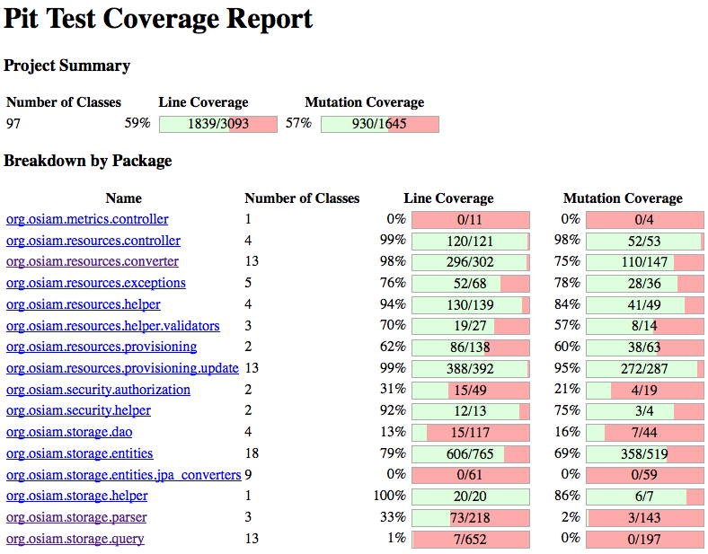

# Mutation tests with PIT (pitest)

PIT is a state of the art mutation testing system, providing gold
standard test coverage for Java and the jvm. Its fast, scalable and
integrates with modern test and build tooling.

[Pitest](http://pitest.org)

---

# What's wrong here?

    !java
    public static String foo(boolean b) {
      if (b) {
        performVitallyImportantBusinessFunction();
        return "OK";
      }

      return "FAIL";
    }

    @Test
    public void shouldFailWhenGivenFalse() {
      assertEquals("FAIL", foo(false));
    }

    @Test
    public void shouldBeOkWhenGivenTrue() {
      assertEquals("OK", foo(true));
    }

---

# And here?
    !java
    public static String foo(int i) {
      if ( i >= 0 ) {
          return "foo";
      } else {
          return "bar";
      }
    }

    @Test
    public void shouldReturnBarWhenGiven1() {
      assertEquals("bar", foo(1));
    }

    @Test
    public void shouldReturnFooWhenGivenMinus1() {
      assertEquals("foo", foo(-1));
    }

---

# Definition

Mutation testing is conceptually quite simple.

 *Faults* (or mutations) are automatically seeded into your code, then
your tests are run. If your tests *fail* then the mutation is *killed*, if
your tests *pass* then the mutation *lived*.

The quality of your tests can be gauged from the percentage of
mutations *killed*.

---

# Show me the results!

---

# How long does it take?

Eaxmple for OSIAM Resource server

    ================================================================================
    - Timings
    ================================================================================
    > scan classpath : < 1 second
    > coverage and dependency analysis : 10 seconds
    > build mutation tests : < 1 second
    > run mutation analysis : 2 minutes and 27 seconds
    --------------------------------------------------------------------------------
    > Total  : 2 minutes and 38 seconds

    ================================================================================
    - Statistics
    ================================================================================
    >> Generated 1645 mutations Killed 930 (57%)
    >> Ran 5927 tests (3.6 tests per mutation)
    ================================================================================

2:27 of 2:48 total!

---

# Integrate it!
    !xml
    <plugins>
      <plugin>
        <groupId>org.pitest</groupId>
        <artifactId>pitest-maven</artifactId>
        <configuration>
          <mutationThreshold>50</mutationThreshold>
          <targetClasses>
            <param>org.osiam.*</param>
          </targetClasses>
          <targetTests>
            <param>org.osiam.*</param>
          </targetTests>
        </configuration>
      </plugin>
    </plugins>

    mvn compile test-compile org.pitest:pitest-maven:mutationCoverage -Dthreads=2

---

# PIT Highlights

 - test coverage first
 - incremental analysis
 - scm based optimization [see Maven Quickstart](http://pitest.org/quickstart/maven/)
 - plugin mutators
 - mutation filters

---

# Mutators
  [Mutators list](http://pitest.org/quickstart/mutators/)

 - Conditionals Boundary Mutator
 - Negate Conditionals Mutator
 - Remove Conditionals Mutator
 - Math Mutator
 - Increments Mutator
 - Invert Negatives Mutator
 - Inline Constant Mutator
 - Return Values Mutator
 - Void Method Calls Mutator
 - Non Void Method Calls Mutator
 - Constructor Calls Mutator
 - Experimental Inline Constant Mutator
 - Experimental Member Variable Mutator
 - Experimental Switch Mutator

---

# Summing up

 - mutation testing is very effective
 - ...but really slow
 - pitest makes it reasonably cheap
 - no excuses to not include in your project!

---

# ...well
 - no excuses maybe besides the lacking CI suitability
 - being worked on...
